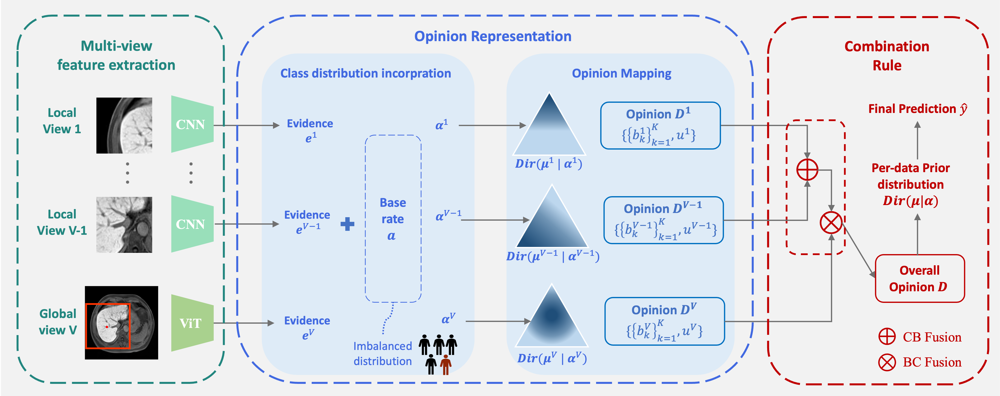

# MERIT: Multi-view Evidential Learning for Reliable and Interpretable Liver Fibrosis Staging

Welcome! This repository provides the official implementation of our two papers:

**MERIT: Multi-view Evidential Learning for Reliable and Interpretable Liver Fibrosis Staging**  
Published in Medical Image Analysis, 2025 [[Arxiv]](https://arxiv.org/abs/2405.02918)

**A Reliable and Interpretable Framework of Multi-view Learning for Liver Fibrosis Staging**  
Published in International Conference on Medical Image Computing and Computer-Assisted Intervention (MICCAI), 2023. **(Oral and nomination for Young Scientist Award and Best paper award)** [[MICCAI]](https://link.springer.com/chapter/10.1007/978-3-031-43904-9_18)



---

## 🚀 News
- **Feb 11, 2025**  
  MERIT accepted by *Medical Image Analysis* (IF=10.7).
- **Sept 20, 2023**  
  MICCAI paper selected as a candidate for **Best Paper** and **Young Scientist Award**.
- **Aug 17, 2023**  
  MICCAI paper awarded **Oral Presentation** (top 3% of submissions).
- **May 25, 2023**  
  Early acceptance at MICCAI 2023 (top 14% of 2,253 submissions).

---

## 🔑 Key Contributions

### MICCAI 2023
1. **First Uncertainty-Aware Multi-View Framework for Liver Fibrosis Staging**  
   Formulated liver fibrosis staging as a multi-view learning problem with Dempster-Shafer fusion.
2. **Global Representation Learning**  
   Integrated global context via data-efficient transformers.
3. **Enhanced MRI Evaluation**  
   Outperformed SOTA methods in accuracy and calibration error on enhanced MRI data.

### MedIA 2025 (Extension)
1. **Class Distribution-Aware Base Rates**  
   Addressed class distribution shifts via base rate in evidential learning.
2. **Feature-Specific Fusion Operators**  
   Improved combination rule with theoretical interpretability.
3. **Comprehensive Validation**  
   Multi-center MRI evaluation under feature/class shifts + ablation studies.

---

## ⚡ Quick Start
### Prerequisites
- Python 3.8+
- PyTorch 1.12+

### Data Preparation
Place your data in `./data/` with:
- `imgs.npy`: Image arrays (shape: [N, H, W])
- `labs.npy`: Class labels (shape: [N])
- `info.npy`: Patient metadata (optional)

### Training

```shell
#!/bin/bash

# MERIT Quick Start Script
# Usage: ./quick_start.sh

python main.py \
    --dataroot YOUR_DATA_PATH \          
    --num_classes CLASSES \
    --num_local_views NUM_LOCAL_VIEWS \
    --task TASK_ID \                     
    --batch_size BATCH_SIZE \            
    --num_workers NUM_WORKERS \          
    --window_size WINDOW_SIZE \          
    --patch_size PATCH_SIZE \            
    --step_size STEP_SIZE \              
    --lr LEARNING_RATE \                
    --epochs NUM_EPOCHS \                
    --coef LOSS_COEF \                   
    --device DEVICE_ID \                 
    --pretrain PRETRAIN_MODE1 PRETRAIN_MODE2  
    --glb USE_GLOBAL \                   
    \
    --output_marker RUN_ID \             
    --epochs_per_vali VAL_INTERVAL \     
    --cross_val USE_CROSSVAL \           
    --rand_seed RAND_SEED \              
    --train_prior USE_TRAIN_PRIOR \      
    --test_prior USE_TEST_PRIOR \        
    --test_cut CUT_RATIO \       
    --combine FUSION_METHOD                        
```

## 📚 Citation

If you find our code useful, please cite our paper as follows:

```bibtex
@article{liu2025merit,
  title={MERIT: Multi-view Evidential Learning for Reliable and Interpretable Liver Fibrosis Staging},
  author={Liu, Yuanye and Gao, Zheyao and Shi, Nannan and Wu, Fuping and Shi, Yuxin and Chen, Qingchao and Zhuang, Xiahai},
  journal={Medical Image Analysis},
  year={2025}
}

@inproceedings{gao2023reliable,
  title={A reliable and interpretable framework of multi-view learning for liver fibrosis staging},
  author={Gao, Zheyao and Liu, Yuanye and Wu, Fuping and Shi, Nannan and Shi, Yuxin and Zhuang, Xiahai},
  booktitle={International Conference on Medical Image Computing and Computer-Assisted Intervention},
  pages={178--188},
  year={2023},
}
```

## 📧 Contact
For questions, contact [Yuanye Liu](mailto:yuanyeliu@fudan.edu.cn) or open an issue.
